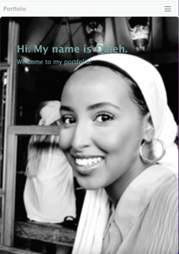
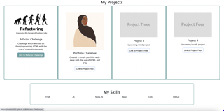
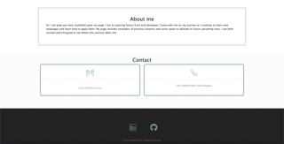

# Bootstrap-Portfolio

In this portfolio website creation project, I had the opportunity to not only showcase my proficiency in HTML and CSS but to also take a significant step forward by seamlessly integrating Bootstrap.
The utilisation of Bootstrap played a pivotal role in ensuring that the website's design is not only visually appealing but also responsive, guaranteeing an optimal user experience.

The portfolio comprises distinct sections, including a sleek navigation bar, an attention-grabbing jumbotron, informative segments like "work" and "skills," along with vital elements like "about," "contact," and a polished footer.
Each link and button within the website features subtle hover effects to enhance appearance and interactivity, providing users with a dynamic experience.
Moreover, the "project" section offers a seamless gateway to explore the deployed web page with a simple click, adding a layer of accessibility and user-friendliness to the overall design.

## Usage

Please see below a screenshots of the webpage attached

## Collaborators

I worked on this challenge with Ikran Hussein GitHub: https://github.com/Ikran1

## References

Avatar image: https://www.vecteezy.com/vector-art/6726223-silhouette-of-a-muslim-woman-with-black-headdress-faceless-female-in-hijab-with-dark-brown-skin-international-women-s-day-and-mother-s-day-hand-drawn-vector-contemporary-abstract-illustration

Placeholder images: https://placehold.co/

Refactor code image: https://lvivity.com/what-is-code-refactoring

Icon images: https://icons8.com/icons/
